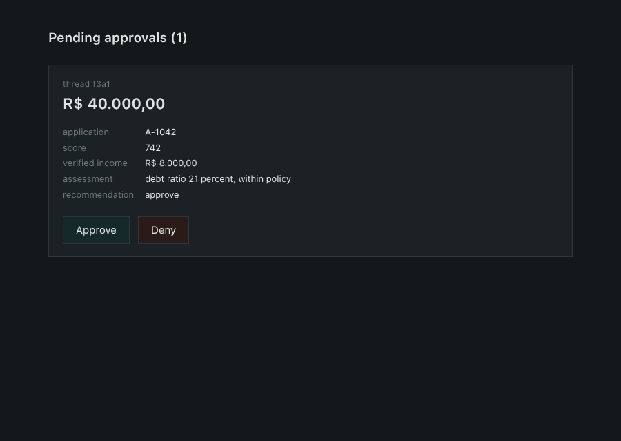
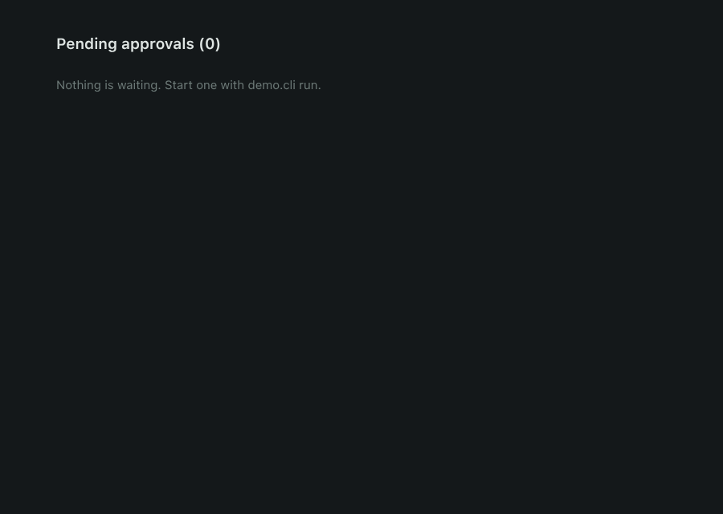

# agentgraph

A small agent graph engine with checkpointing and human-in-the-loop.
No dependencies. Run it, kill the process, resume it.

An agent that only answers questions is harmless. An agent that *acts* — moves
money, deletes a file, sends mail — does things you cannot undo, and nobody puts
that in production without a human approving first. But an agent is a running
program: if it stops to wait for a person, you are holding a process open for
hours or days. Nobody does that.

So the state has to leave memory and go to disk, and the agent has to be able to
die and come back. That is the whole idea, and it is what this repository is.

## See it

```
$ python -m demo.cli run --application A-1042
[fetch_application] proposal A-1042, R$ 40.000,00 over 24 months
[score]             score 742, declared income R$ 8.500,00
[assess]            income not verified yet
[fetch_income]      verified income R$ 8.000,00
[assess]            debt ratio 21 percent, within policy
[check_threshold]   40000.00 above the 5000.00 limit
PAUSED  thread=f3a1  waiting: approve credit of R$ 40.000,00 for customer 88231?
```

The process is gone. Close the terminal, reboot, come back tomorrow:

```
$ python -m demo.cli resume f3a1 approved
[human_approval]    answer: approved
[disburse]          credit of R$ 40.000,00 released
OK
```

Between those two commands nothing is alive. No daemon, no waiting thread, no
object in memory. The only link is a SQLite file.

Note that `[assess]` runs twice in the first command. The graph has a cycle:
`assess` decided it could not judge without a verified income, routed to
`fetch_income`, and came back. That is the difference between a graph and a
pipeline.

Under the limit, nobody is asked:

```
$ python -m demo.cli run --application A-2001
...
[check_threshold]   3000.00 within the 5000.00 limit
[disburse]          credit of R$ 3.000,00 released
```

## The approval screen

The terminal is not where an approval lives. Same state, same `resume`, with a
page in front of it:

```
$ python -m demo.cli run --application A-1042
$ python -m demo.inbox
approvals on http://127.0.0.1:8000
```



Every thread the engine paused shows up with what it takes to decide and nothing
else: the amount, the score and verified income, the assessment the agent
reached, and its recommendation. Only the conclusion, not the whole trail —
`assess` also produced "income not verified" on its first pass, and showing that
next to the verified figure would slow the reader down instead of helping. Approving calls
`resume(thread_id, "approved")`, exactly what the CLI calls.

It answers with `303 See Other` rather than a page, so reloading in the browser
cannot approve twice. Served by `http.server`, HTML built in Python: no
framework, no build step, no JavaScript.



The engine has finished the thread by the time the page comes back:

```
$ python -m demo.cli status f3a1
DONE       released
```

## Run it

Python 3.9 or newer. Nothing to install to run it.

```
git clone https://github.com/dv-dev1/agentgraph && cd agentgraph
python -m demo.cli run --application A-1042
python -m pytest -q
```

The test suite needs no API key, no network and no account. Four of the tests
drive the inbox in a real browser and are skipped unless Playwright is present:

```
pip install -r requirements-dev.txt && playwright install chromium
```

They are what proves the button submits, not just that the endpoint answers.

The engine itself stays clean. `agentgraph/` imports only `sqlite3`, `json`,
`contextvars`, `datetime` and `typing`:

```
grep -rn "^import \|^from " agentgraph/ \
  | grep -v "sqlite3\|json\|contextvars\|datetime\|typing\|agentgraph"
```

That prints nothing.

## How it works

Four files, 279 lines counting docstrings.

| File | What lives in it |
|---|---|
| `agentgraph/state.py` | the reducers, and merging a node's return value into the state |
| `agentgraph/checkpoint.py` | SQLite, one row per step |
| `agentgraph/graph.py` | assembly, validation, the execution loop, `resume` |
| `agentgraph/interrupt.py` | `interrupt()` and the exception behind it |

A node is a plain function. It never touches the database and never learns that
it was paused:

```python
def assess(state: dict) -> dict:
    if "verified_income" not in state["customer"]:
        return {"facts": ["income not verified"]}
    return {"amount": state["application"]["value"], "facts": ["within policy"]}
```

It returns **only what changed**, and a schema says how each field is joined:

```python
SCHEMA = {
    "facts":  add,       # old list + new list
    "amount": replace,   # the new value wins
}
```

A field the node did not return stays as it was. A field that is not in the
schema raises, so a typo in a return value fails at the merge instead of
becoming a ghost field three steps later.

Asking a human is one call:

```python
def human_approval(state: dict) -> dict:
    answer = interrupt(f"approve credit of {state['amount']}?")
    return {"approved": answer == "approved"}
```

`interrupt` raises on the first pass. The engine catches it, writes the state
and the question to SQLite, and returns. On `resume`, the same call returns the
human's answer instead.

## The trap

Resuming does not continue from the line after `interrupt`. It runs the node
again **from its first line**. Everything above the call happens twice.

```python
def bad(state):
    send_email(state)                 # sent twice
    answer = interrupt("proceed?")
    ...
```

The semantics are at-least-once per node, and LangGraph is no different. The fix
is not in the engine, it is in where you put side effects: below the
`interrupt`, or in a node of their own. There is a test pinning this behaviour
so nobody "fixes" it by accident.

The same trap arrives through the front door as a double click, so `resume`
refuses a thread that is not paused:

```
$ python -m demo.cli resume f3a1 approved
ERROR: thread f3a1 is not paused
```

## If you know LangGraph

This is the same shape, with the same names, small enough to read in one sitting.

| Concept | Here | LangGraph |
|---|---|---|
| assemble | `Graph()`, `add_node`, `add_edge` | `StateGraph`, same methods |
| join state | `SCHEMA` with `add` / `replace` | `Annotated[list, operator.add]` |
| pick the next node | `add_conditional_edge` | `add_conditional_edges` |
| freeze and validate | `compile()` | `compile(checkpointer=...)` |
| identify a run | `thread_id` | `thread_id` in the config |
| store the state | SQLite, one row per step | `SqliteSaver`, `PostgresSaver` |
| pause | `interrupt()` | `interrupt()` |
| resume | `resume(thread_id, answer)` | `Command(resume=...)` |
| step ceiling | counter in the loop | `recursion_limit` |

## Calling a model

The demo applies rules instead of calling a model, so the suite runs with no
API key. The engine does not care either way — a node that calls a model is a
node like any other:

```python
def assess(state: dict) -> dict:
    reply = client.messages.create(model="claude-sonnet-5", max_tokens=256,
                                   messages=[{"role": "user", "content": prompt(state)}])
    return {"facts": [reply.content[0].text]}
```

Nothing in `agentgraph/` changes. That is the point of the boundary.

## What this is not

- No `async`, no parallel nodes, no subgraphs, no event streaming, no retries.
- One process at a time per thread: there is no lock, so two concurrent
  `resume` calls on the same thread are not defended against.
- The approval screen has no login and no per-user limits. It runs on
  `localhost` and it is a demonstration.
- Not a LangGraph replacement. It is the part of LangGraph that explains the
  rest, written out by hand.
